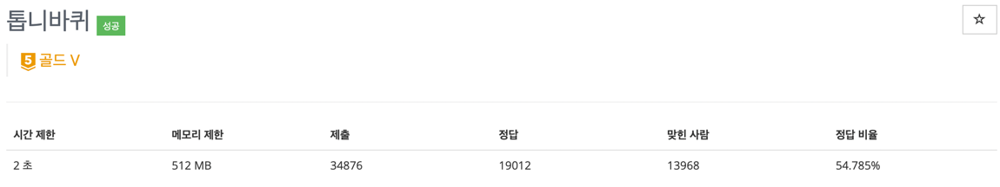

> <https://www.acmicpc.net/problem/14891>


## 문제 설명
- 톱니 바퀴는 총 4개가 맞물려있으며 한 개의 톱니바퀴가 시계 방향으로 돌면 해당 톱니바퀴와 맞닿아 있는 톱니바퀴들은 반시계 방향으로 돌게된다.
- 이 때, 톱니바퀴끼리 맞닿아 있는 부분이 같은 자성을 띈다면 맞닿아 있는 톱니는 회전하지 않는다.

## 풀이 계획
### 1. Deque 자료구조를 활용한 톱니바퀴 돌리기(절대 안됨!)
- 톱니바퀴가 돌 때 deque 자료구조의 특징을 활용해서 넣고 빼고를 하는 것을 생각했다.
- 양쪽 끝에 대한 정보만 알 수 있기 때문에 맞닿아 있는 부분이 같은 자성을 띄는지 아닌지를 판별할 수가 없다. 

### 2. Bitmasking을 활용한 톱니바퀴 돌리기
- 주어진 톱니의 정보가 0, 1로만 이루어져있는 것을 보고 Bitmasking을 활용해서 돌리는 것이 가능하겠다고 생각했다.
- 맞닿아있는 부분에 대한 추적도 용이하고 톱니바퀴를 돌리는 것도 빠른 시간 안에 가능하기 때문에 좋은 방법이라고 생각했다.

## 풀이 과정
### 1. check Method
- 특정 톱니바퀴를 돌리는 정보가 주어졌을 때 나머지 톱니들은 어떻게 돌릴지를 결정하는 함수를 만들어줬다.
- DFS 방식을 활용해서 추적해주는 방식을 선택했다. 

### 2. update Method
- check Method에서 확인한 톱니바퀴를 어느 방향으로 돌릴지에 대한 정보를 활용해 톱니바퀴를 돌려준다.
- 시게 방향으로 돌릴 때는 모두 같지만, 반시계 방향으로 돌리는 경우 주의해야한다.
- 반시계 방향으로 돌릴 경우, 주어진 gear 정보를 binary로 전환 시 무조건 8자리가 보장되지 않는다.
- 그렇기 때문에 binaryString을 활용해서 현재 binary코드가 8자리 이하일 경우와 이상일 경우를 구분해야한다.
- 8자리 이하일 경우는 그냥 shift 연산자를 활용하면 되지만 반대의 경우는 넘어가는 bit를 추적해서 업데이트 해줘야한다.

### 3. answer Method
- 주어진 조건 중 몇 번째 톱니의 12시 방향에 어떤 자성을 띄는 톱니가 오는지에 따라 점수 환산 방식이 다르다. 
- 이를 추적해주기 위해 answer method를 따로 구현해주었다. 

## 구현 코드
```java

    package boj.gold5;
    
    import java.io.BufferedReader;
    import java.io.IOException;
    import java.io.InputStreamReader;
    import java.util.*;
    
    /**
    
     - @author 이병헌
     - @since 2023/10/01
     - @see https://www.acmicpc.net/problem/14891
     - @git https://github.com/Hunnibs
     - @youtube
     - @performance
     - @category # bitMasking
     - @note */
    
    public class BOJ_14891 {
        static int[] gear = new int[4];  // 톱니는 총 4개
        static int[] delta = {-1, 1};
    
        public static void main(String[] args) throws IOException {
            BufferedReader br = new BufferedReader(new InputStreamReader(System.in));
            StringTokenizer st;
            StringBuilder sb = new StringBuilder();
    
            for (int i = 0; i < 4; i++) {
                gear[i] = Integer.parseInt(br.readLine(), 2);
            }
    
            int K = Integer.parseInt(br.readLine());
            for (int i = 0; i < K; i++) {
                st = new StringTokenizer(br.readLine());
                int gearNum = Integer.parseInt(st.nextToken()) - 1;
                int dir = Integer.parseInt(st.nextToken());
    
                check(gearNum, dir);
            }
    
            System.out.println(answer());
        }
    
        private static void check(int gearNum, int dir) {
            int[] checked = new int[4];  // gear가 어느 방향으로 돌아가는지 체크하기 위한 배열
            boolean[] visited = new boolean[4];
            Stack<Integer> stack = new Stack<>();
    
            int bit;
    
            checked[gearNum] = dir;  // 처음 돌리는 톱니바퀴는 주어지는 방향으로 돌린다.
            visited[gearNum] = true;
            stack.push(gearNum);
    
            while (!stack.isEmpty()) {
                int current = stack.pop();
                for (int i = 0; i < 2; i++) {  // 톱니가 맞물리는건 최대 2방향 (양 끝을 제외)
                    int next = current + delta[i];
                    if (next >= 0 && next < 4 && !visited[next]) {
                        // 돌리고 싶은 기어가 왼쪽에 맞물려 있는지 오른쪽에 맞물려있는지에 대한 분기
                        // 돌릴 수 있을 때는 현재 기어가 돌아가는 방향에 반대 방향으로 다음 기어를 돌려야한다.
                        if (current < next) {
                            if ((((gear[next] & (1 << 1))) >> 1) != (((gear[current] & (1 << 5))) >> 5)) {
                                checked[next] = checked[current] * (-1);
                            }
                        } else {
                            if ((((gear[current] & (1 << 1)) >> 1)) != (((gear[next] & (1 << 5)) >> 5))) {
                                checked[next] = checked[current] * (-1);
                            }
                        }
                        visited[next] = true;
                        stack.push(next);
                    }
                }
            }
            update(checked);
        }
    
        private static void update(int[] checked) {
            int bit;
            for (int i = 0; i < 4; i++) {
                if (checked[i] == 1) {  // 시계 방향으로 돌리는 경우
                    // bit를 우 Shift 하게 된다면 gear의 가장 오른쪽 비트는 밀려서 사라지기 때문에 미리 bit에 저장해준다.
                    bit = gear[i] & 1;
                    bit = bit << 7;
                    gear[i] = gear[i] >> 1;
                    gear[i] = gear[i] | bit;
                } else if (checked[i] == -1) {  // 반시계 방향으로 돌리는 경우
                    gear[i] = gear[i] << 1;
                    if (Integer.toBinaryString(gear[i]).length() > 8) {  // 왼쪽으로 밀었을 때 해당 비트의 길이가 8 이상이라면 작업을 실시한다. -> 이유는 8 이하면 그냥 밀면 되기 때문
                        bit = gear[i] & (1 << 8);  // 길이가 넘는 비트를 가져와서 가장 오른쪽 비트로 넣어준다.
                        bit = bit >> 8;
                        gear[i] = gear[i] | bit;
                        gear[i] = gear[i] & 0b11111111;  // 톱니가 이상해지는걸 방지하기 위해 길이 8짜리 톱니로 다시 만들어주자!
                    }
                }
            }
        }
    
        private static int answer() {  // 12시 방향에 따른 점수 계산을 위한 코드
            int sum = 0;
            for (int i = 0; i < 4; i++) {
                if ((((gear[i] & (1 << 7))) >> 7) == 1) {  // 가장 왼쪽 비트가 12시 방향이다.
                    sum += (int) Math.pow(2, i);
                }
            }
            return sum;
        }
    }


```