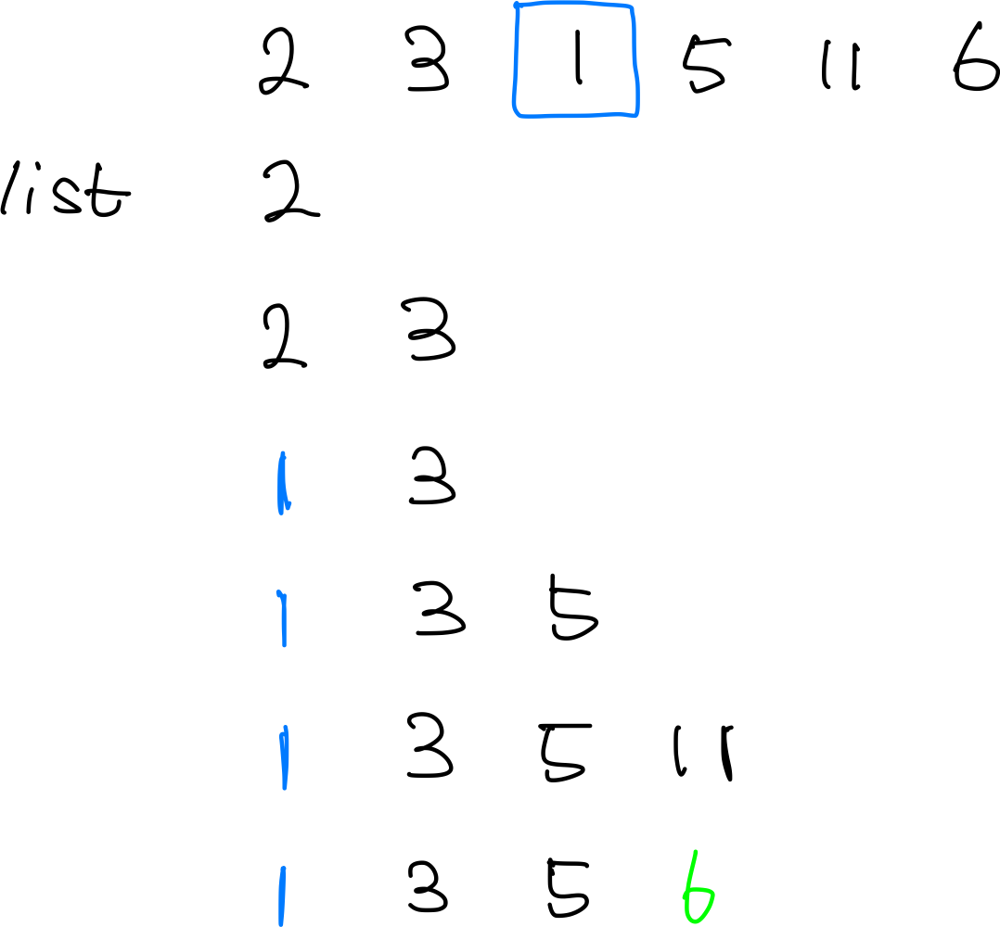

* TOC
  {:toc}
***
### LIS 알고리즘이란?
***
가장 긴 최장 증가 수열을 구하는 알고리즘으로 특정 숫자의 배열이 주어졌을 때 해당 수열에서 가장 큰 사이즈의 증가 수열을 만들어내기 위해 사용하는 알고리즘이다.

### 구현 방법
***
구현 방법은 크게 두 가지로 나뉘는데 DP 테이블만을 이용해 구현하는 방식과 동적인 DP table을 만들어 이분 탐색과 함께 활용하는 방법이다.

1. DP table을 활용한 LIS의 풀이
- 해당 방법은 O(N^2)의 방법으로 시간 상 굉장히 비효율적인 방법이다.
- 하지만 별도의 작업 없이 DP table만 잘 활용한다면 손쉽게 구현이 가능하다. 

> table의 column에는 주어지는 수열의 값들을 순서대로, row에는 해당 수열의 길이만큼 만들어 테이블 내에는 최장 길이가 어느정도까지 될지 저장해준다.   
> 아래 코드는 눈으로 보기 쉽게 2차원 테이블로 구현한 코드이고 1차원 배열로도 구현이 가능하다. 

```java

      for (int i = 1; i < N+1; i++) {
          int idx = Integer.parseInt(st.nextToken());
          int max = 0;
          for (int j = 0; j < N+1; j++) {
              if(dp[i-1][j] != 0){
                  dp[i][j] = dp[i-1][j];
                  if (j < idx) {
                      max = Math.max(dp[i][j], max);
                  }
              }
          }
          dp[i][idx] = max+1;
      }

```

- 테이블을 업데이트 할 때는 수열의 특정 index값이 들어올 때 그 값보다 작은 값들로 만들 수 있는 최장길이에 +1을 해주는 방식이다. 
- 위 코드를 1차원 배열로 더 단순화한다면 다음과 같다. 

```java

      for (int i = 0; i < N; i++) {
          int idx = Integer.parseInt(st.nextToken());
          int max = 0;
          for (int j = 1; j < idx; j++) {
              max = Math.max(max, dp[j]);
          }
          dp[idx] = max+1;
      }

```

- DP table을 이용한 방식은 마지막에 해당 테이블에서 가장 최대의 길이를 찾아주는 연산을 별도로 시행해야된다는 불편함이 있다.

2. 이분 탐색을 함께 활용한 LIS의 풀이
- 위의 방식은 미리 수열의 숫자 크기만큼 배열을 미리 할당해야해서 메모리 적으로도 부담이 크다.
- 해당 방식은 동적으로 메모리를 할당하고 탐색 또한 이분 탐색을 활용하기 때문에 시간적으로도 이득이다.
- 시간복잡도는 O(NlogN)이다.



- 해당 그림은 업데이트 과정을 시각화 한 것이다.   

- 조건
  1. 리스트가 비어있거나 현재 리스트에 있는 가장 큰 값보다 더 큰 값이 들어오면 리스트의 길이는 늘려준다.
  2. 이외의 경우는 들어오는 숫자보다 큰 값을 대체해준다.(해당 값과 차이가 가장 작은 값)   

> 값을 더 작은 값으로 업데이트 해주는 이유   
> LIS 내부의 값들은 작은 값으로 업데이트 되는 이유가 크게 없지만 마지막 index의 경우 해당 값보다 작은 값이 들어온다면 업데이트를 해줘야지 다음에 올 수열이 꼬이지 않는다.   
> 그림을 예시로 들자면 1은 들어올때 아무 의미가 없지만 11에서 6으로 바뀐 경우는 다음으로 7이 들어올 경우 리스트의 길이를 늘릴 수 있다는 점을 가능케해준다.
```java

    List<Integer> list = new ArrayList<>();
    for (int i = 0; i < N; i++) {
        int target = Integer.parseInt(st.nextToken());
        if (list.isEmpty()){
            list.add(target);
            continue;
        } else {
            int idx = Math.abs(Collections.binarySearch(list, target))-1;
            if (idx > list.size()-1){
                list.add(target);
            } else{
                list.set(idx, target);
            }
        }
    }

```

### 주의할 점
***
해당 알고리즘은 최장 증가 수열 내용물 그 자체를 추적하는 것은 불가능하다. 위 알고리즘은 어디까지나 수열에서 만들 수 있는 최장 증가 수열의 길이가 어느정도일지를 알아내는 것 뿐이다. 